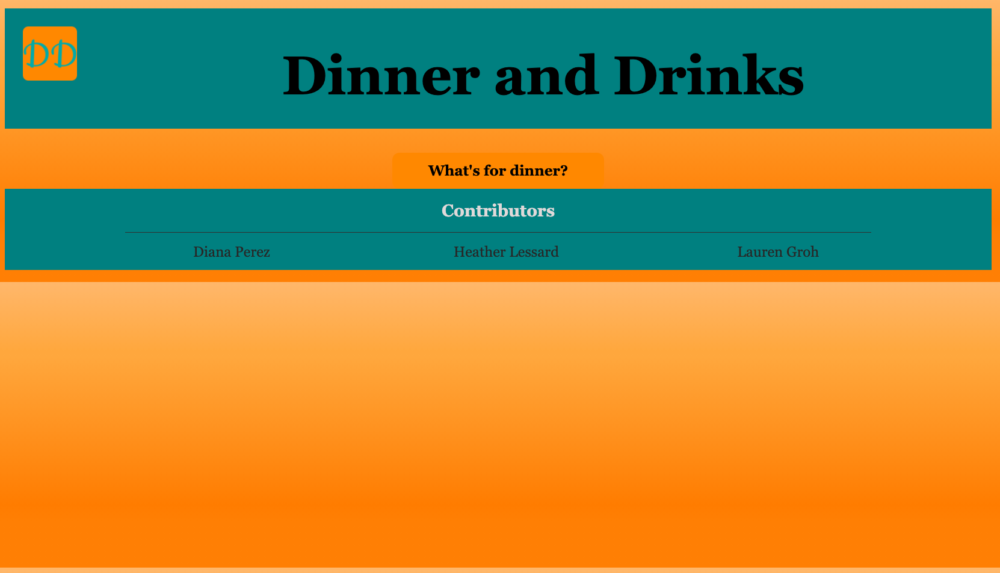
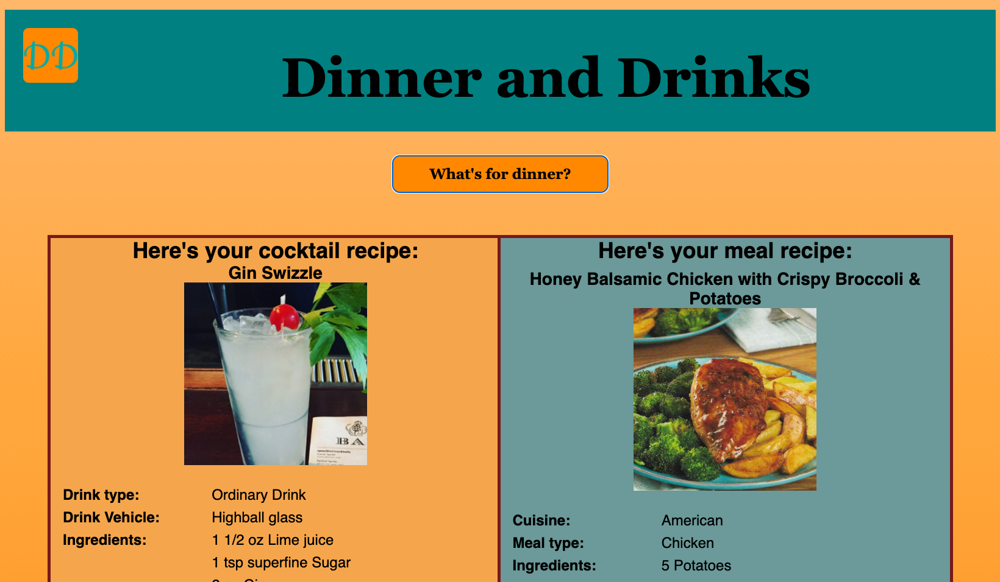
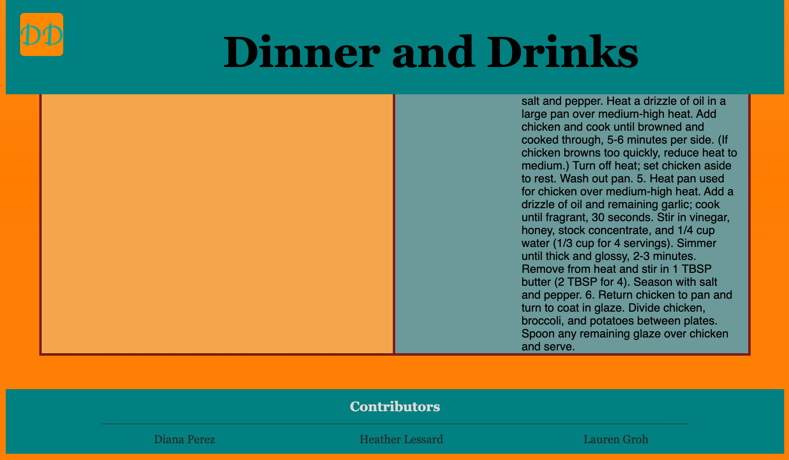

# DINNER & DRINKS

## TABLE OF CONTENTS
--------------------

* Introduction
* User Story
* User Instructions
* Live link & screenshots
* Technologies used
* Maintainers

## INTRODUCTION
---------------

Dinner & Drinks is the app for anyone who is hosting a last-minute dinner party and needs recipe ideas. Built with HTML, CSS, JavaScript, and pulling data using client-side APIs, busy adults would find this app useful for preparing new and interesting meals during the work week.

## USER STORY
---------------

GIVEN I am an adult, hosting a dinner party
WHEN I click a button on the page
THEN I'm presented with an option for both a dinner and a cocktail recipe to try

## USER INSTRUCTIONS
--------------------

1. Click the "What am I making?" button
2. Find a cocktail recipe on the left
3. Find a meal recipe on the right
4. Click the "What am I making?" button again
5. Find new cocktail and meal recipes

**View the application, here:** [Dinner & Drinks](https://grohtech.github.io/dinner-and-drinks/ "Dinner & Drinks")

**View website screenshots, here:**  

 
 

## TECHNOLOGIES USED
--------------------

* HTML
* CSS
* JavaScript
* Git
* APIs
    1. [TheCocktailDB](https://www.thecocktaildb.com/api.php "TheCocktailDB")
    2. [TheMealDB](https://www.themealdb.com/api.php "TheMealDB")
* CSS Framework
    1. [PureCSS](https://purecss.io/layouts/ "PureCSS")

## MAINTAINERS
--------------

1. Heather Lessard - [Github](https://github.com/Hmlessard "Github Profile")
2. Diana Perez - [Github](https://github.com/Perez-outlook "Github Profile")
1. Lauren Groh - [GitHub](https://github.com/GrohTech "GitHub Profile")
